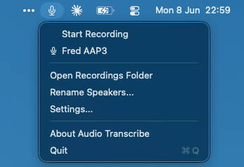
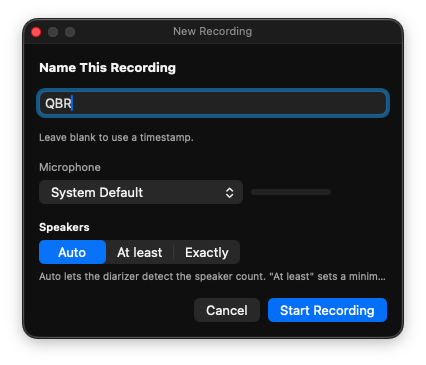
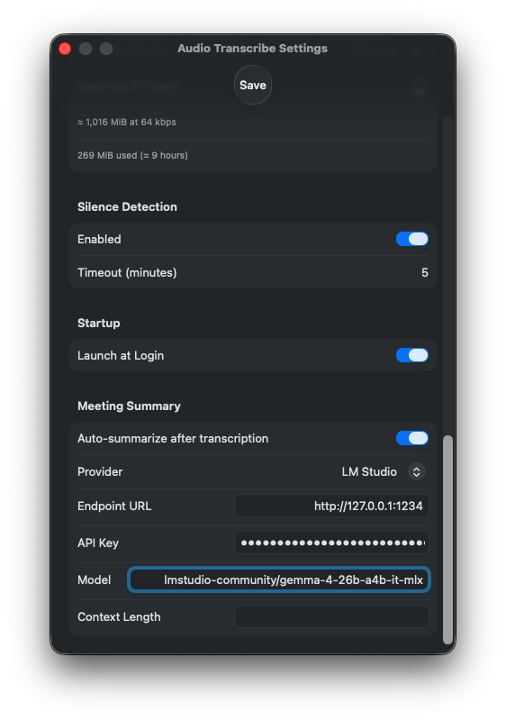
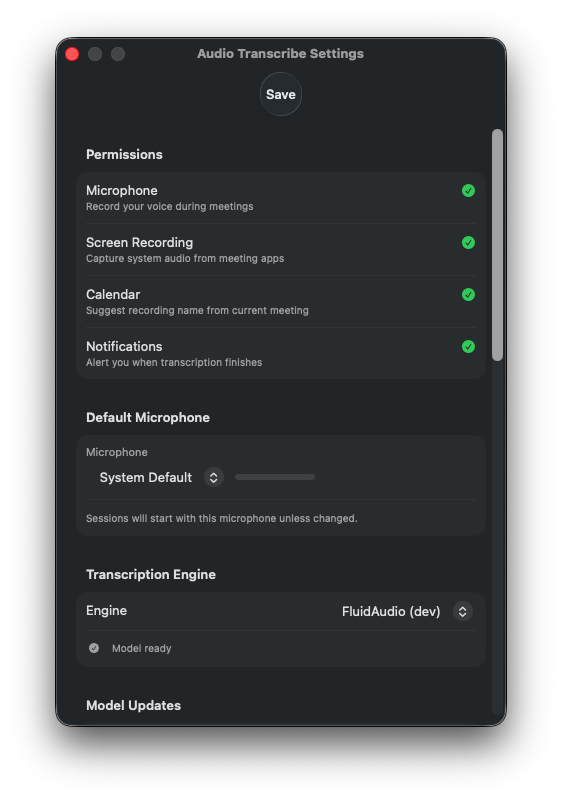

# parley

> Private, on-device meeting transcription for Apple Silicon. Captures your microphone **and** the
> far side of the call (Zoom, Teams, Meet, Slack, FaceTime), and turns them into speaker-attributed
> transcripts that never leave your Mac. 100% open-source, open-model, airgapped.


🤝 **Sister project:** [**mailrag**](https://github.com/fmasi/mailrag) — private, self-hosted email RAG. Two halves of one idea: a private, open context stack your AI agents can draw on.

> **What it buys you.** Meeting transcription that's *private by construction* — every byte stays on
> your Mac, on open models, with nothing phoning home. The default engine transcribes 17 minutes of
> audio in **~7 seconds (146× real-time)** on the Apple Neural Engine, separates "you" from "them"
> with **dual-stream capture**, labels who-said-what with **on-device diarization**, and survives an
> app or service crash mid-recording with **zero data loss**.

<p align="center">
  
</p>

## Why this exists

The first time I used cloud AI for meeting notes it felt like a cheat code — until I thought about
what I was actually doing: uploading the raw audio of every meeting to someone else's servers. For
anything confidential, that's a non-starter.

So I built the opposite. parley runs entirely on your Mac, on open models, with nothing
phoning home — no account, no upload, no vendor to trust.

Then the real point clicked. These transcripts aren't just notes, they're **context**. A faithful,
private record of what was actually said is exactly what an AI agent needs to be useful about *your*
work — kept on-device, so you get total recall without renting your memory to anyone. parley
is one private context source, for calls and meetings. [mailrag](https://github.com/fmasi/mailrag) is
another, for email — different domain, different machinery (vector-DB retrieval). They don't talk to
each other; my agents know about both and reach for whatever fits. The point was never a single app —
it's a private, open stack of context I own.

## What it does

- **Dual-stream capture** — records your microphone and the system audio as *separate* streams, so
  local and remote voices stay distinguishable. Works with any app. No virtual audio drivers, no
  kernel extensions.
- **On-device speaker diarization** — automatic who-said-what (pyannote + WeSpeaker + VBx), with a
  quality score on every segment.
- **Two transcription engines** — FluidAudio (Parakeet — fastest, 25 EU languages) or Apple
  SpeechAnalyzer (macOS 26+, no download). Swap them in Settings.
- **Echo / mic-bleed removal** — strips the far-end voice that bleeds into your mic on speakers, so it
  doesn't show up as a phantom speaker.
- **Crash-safe recording** — survives UI and XPC crashes with auto-relaunch, silent re-attach, and
  multi-segment stitching.
- **Multiple outputs** — JSON, SRT, and TXT with absolute timestamps, speaker labels, confidence
  scores, and local/remote tags.
- **Optional local LLM summaries** — point it at any OpenAI-compatible or LM Studio endpoint (including
  a fully local model) for a meeting summary, still without touching the cloud.
- **CLI included** — transcribe, rename speakers, summarize, and benchmark from the terminal.

## Screenshots

<p align="center"><br><em>Start a session — name it, pick a mic, and tell the diarizer how to count speakers.</em></p>

<p align="center"><br><em>Even the optional summary stays local — pointed at a model on <code>127.0.0.1</code>, never the cloud.</em></p>

<p align="center"><br><em>Transparent permissions, and a one-click switch between the FluidAudio and Apple engines.</em></p>

## Quickstart

```bash
git clone https://github.com/fmasi/parley.git
cd parley
bash package_app.sh --install      # builds the Swift targets, assembles the .app + XPC service,
                                   # ad-hoc signs everything, installs to /Applications
open /Applications/AudioTranscribe.app
```

On first launch, macOS asks for **Screen & System Audio Recording** permission. The default engine
downloads its model (~500 MB) on first use and caches it after that.

**Requirements:** macOS 15+ (Sequoia), Apple Silicon (M1–M5), Xcode Command Line Tools. *(The Apple
SpeechAnalyzer engine additionally requires macOS 26+.)*

## How it works — the hard parts

The interesting engineering isn't the transcription call; it's everything around keeping the record
faithful and private.

- **Dual-stream capture (the core constraint).** macOS exposes *no* API for a pre-mixed mic + system
  stream — verified through the macOS 26 SDK headers. So the app runs two ScreenCaptureKit streams and
  treats "local" (mic) and "remote" (system) as first-class. That constraint is *why* reliable speaker
  separation is possible at all.
- **Echo / mic-bleed removal.** On speakers, the far-end voice bleeds into your mic and shows up as a
  phantom local speaker. A triple-confirmed gate removes it: >50% temporal overlap **and** >70% word
  overlap **and** >0.8 speaker-embedding cosine — all three, or it stays.
- **Cross-chunk speaker reconciliation.** Audio is chunked and transcribed in parallel; per-chunk
  speaker IDs are merged into one global identity via greedy cosine matching on embeddings.
- **Crash-safe by design.** A sentinel file + LaunchAgent restart + multi-segment stitching mean a UI
  or XPC crash mid-meeting costs ~300–800 ms, not your recording. WAV files sync to disk every 0.5 s.
- **Fully on-device ML.** Parakeet ASR + pyannote/WeSpeaker/VBx diarization + VAD, all running on the
  Apple Neural Engine.

For the full design — XPC architecture, ScreenCaptureKit constraints, the pipeline — see
[ARCHITECTURE.md](ARCHITECTURE.md).

## Transcription engines

| Engine | Speed (17 min audio) | Download | Languages | macOS |
|---|---|---|---|---|
| **FluidAudio** (Parakeet) | ~7 s (146× real-time) | ~500 MB | 25 EU languages | 15.0+ |
| **Apple SpeechAnalyzer** | ~10 s (102× real-time) | none | system languages | 26.0+ |

FluidAudio adds inverse text normalization ("two hundred" → "200"), speaker diarization, and
per-segment confidence scores. Speed figures are from the bundled benchmark harness
(`tools/engine-benchmark`) on Apple Silicon.

## Output

Transcripts are written as JSON, with SRT or TXT alongside:

```json
{
  "metadata": { "language": "multilingual", "diarization": true, "dual_stream": true },
  "segments": [
    { "start": 1.6,  "end": 8.72, "speaker": "Speaker 1", "source": "local",
      "text": "On March 15, 2026, we held a meeting with 342 participants.", "confidence": 0.963 },
    { "start": 49.2, "end": 56.08, "speaker": "Speaker 2", "source": "remote",
      "text": "Le 14 juillet 2026, nous avons organisé une conférence.", "confidence": 0.941 }
  ]
}
```

`source` is `local` (your mic) or `remote` (the far side) — the dual-stream signal that makes the
record trustworthy.

## CLI

```bash
# Transcribe audio files (system + optional mic stream)
.build/debug/AudioTranscribe transcribe -i system.wav [-i mic.wav] [-f srt] [--engine fluid_audio]

# Rename detected speakers interactively
.build/debug/AudioTranscribe rename -i transcript.json

# Summarize a transcript with a local/remote LLM
.build/debug/AudioTranscribe summarize -i transcript.json

# Benchmark engines (speed + WER) across languages
swift run --package-path tools/engine-benchmark EngineBenchmark audio.wav --engines fluid,speech
```

## Project layout

```
TranscriberApp/        SwiftUI menu-bar app (MenuBarExtra + Settings), XPC client, chunk processing
TranscriberCore/       engines, diarization, echo-dedup, speaker reconciliation, summaries, transcript I/O
AudioCaptureHelper/    XPC audio-capture service (ScreenCaptureKit, dual-stream)
AudioCaptureProtocol/  shared @objc XPC protocol
SwiftTests/            384 tests across 38 suites
tools/engine-benchmark/  WER + speed benchmark harness
docs/                  architecture, pipeline, parameters, gotchas
```

## Documentation

- [ARCHITECTURE.md](ARCHITECTURE.md) — XPC design, ScreenCaptureKit constraints, the dual-stream model
- [docs/pipeline.md](docs/pipeline.md) — end-to-end pipeline: recording → transcription → echo dedup → summary
- [docs/parameters.md](docs/parameters.md) — every tunable parameter, with config keys and defaults
- [docs/gotchas.md](docs/gotchas.md) — hard-won platform gotchas (macOS APIs, ScreenCaptureKit, XPC, audio formats)

## Models & credits

parley runs on open models that download on first use — nothing is sent to the cloud:

| Component | Model | License |
|---|---|---|
| Speech recognition | [NVIDIA Parakeet TDT 0.6B](https://huggingface.co/nvidia/parakeet-tdt-0.6b-v3) (CoreML via [FluidInference](https://huggingface.co/FluidInference)) | CC-BY-4.0 |
| Speaker diarization | [pyannote](https://huggingface.co/pyannote) segmentation + [WeSpeaker](https://huggingface.co/pyannote/wespeaker-voxceleb-resnet34-LM) embeddings | CC-BY-4.0 |
| Voice activity detection | [Silero VAD](https://github.com/snakers4/silero-vad) | MIT |
| Engine SDK | [FluidAudio](https://github.com/FluidInference/FluidAudio) | Apache-2.0 |
| Apple engine (optional) | SpeechAnalyzer — on-device, macOS 26+ | OS-provided |

All model weights are CC-BY-4.0 or MIT — free for commercial and non-commercial use with attribution.

## Built by Frédéric Masi

I build private, on-device context tools for AI agents — software that gives an agent (and me) total
recall over my own work without sending anything to the cloud. parley covers calls and
meetings; [mailrag](https://github.com/fmasi/mailrag) covers email.

I care about on-device ML, audio, and systems that stay correct when things crash. If that's useful to
you, or you're hiring, I'd like to hear from you.

- **LinkedIn** — https://www.linkedin.com/in/fmasi/
- **GitHub** — https://github.com/fmasi

## License

Open source under the **GNU AGPL-3.0** — see [`LICENSE`](LICENSE) and [`NOTICE`](NOTICE).
Copyright © 2026 Frédéric Masi.

If you build on this code, the AGPL requires your derivative — including any networked
service — to be released under the same license. **Dual licensing:** as the sole copyright
holder, I also offer parley under separate commercial terms (proprietary binaries,
App Store). For a commercial license, reach out via [LinkedIn](https://www.linkedin.com/in/fmasi/).
